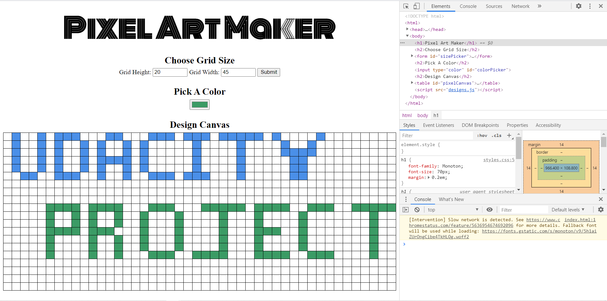

Pixel art maker

Udacity project for Intro to Programming Nanodegree

## How to run
Open the root folder and run the index.html file which will open on your default browser

## How it works
Whole numbers are to be entered in Grid Height and width.
After entering and clicking submit, an empty grid appears.
A color type is selected from "pick a color" and the user can draw with the color appearing in the squares.
Clicking submit again, clears the grid and double clicking on a square with color removes the color.

## References
[jQuery rules](https://www.w3schools.com/jquery/jquery_ref_selectors.asp)

[Answers to questions for Pixel art maker project ](https://knowledge.udacity.com/)

[Defining and linking jQuery to HTML](https://stackoverflow.com/questions/14106864/linking-jquery-in-html)
